<!-- Generated by GitHub Profile Agent Console. Edit profile.config.json, then run npm run generate. -->

  <picture>
    <source media="(max-width: 760px) and (prefers-color-scheme: dark)" srcset="./assets/hero/agent-console-38bf3b33-mobile-dark.svg">
    <source media="(max-width: 760px)" srcset="./assets/hero/agent-console-38bf3b33-mobile-light.svg">
    <source media="(prefers-color-scheme: dark)" srcset="./assets/hero/agent-console-38bf3b33-dark.svg">
    <source media="(prefers-color-scheme: light)" srcset="./assets/hero/agent-console-38bf3b33-light.svg">
    
  </picture>

  

## About Me

I am an Informatics Engineering student focused on building scalable web applications, interactive games, and efficient IoT systems.

Combining software development and graphic design, I aim to create intuitive, visually appealing, and impactful digital solutions.

## Current Focus

| Area | What I am exploring |
| --- | --- |
| **Web Development** | Building full-stack web applications with PHP, Laravel, JavaScript, and MySQL. |
| **Game Development** | Creating interactive 2D/3D games and experiences using Unity, C#, and Blender. |
| **IoT & Systems** | Developing hardware-software monitoring solutions using Arduino and ESP32. |

## Featured Work

| Project | Focus | Why it matters |
| --- | --- | --- |
| [**Farma**](https://github.com/YedijaAdyaVesaka/Farma) | React Native Mobile App | Health medicine recommendations and health article management app built with React Native & Firebase. |
| [**Find Lost Livestock**](https://github.com/YedijaAdyaVesaka/Find-Lost-Livestock) | Game Development | An interactive game focused on searching and rescuing lost livestock. |
| [**ERP KonveksiKita**](https://github.com/YedijaAdyaVesaka/ERP-KonveksiKita) | Enterprise Resource Planning | An ERP management system tailored for garment manufacturing and inventory tracking. |
| [**SI Gereja**](https://github.com/YedijaAdyaVesaka/Sistem-Informasi-Gereja) | Information System | A web-based church management system handling member directory and schedules. |
| [**IoT Monitoring**](https://github.com/YedijaAdyaVesaka/IoT-Monitoring-System) | IoT Hardware/Software | Real-time monitoring system integrating microcontrollers (Arduino/ESP32) and dashboards. |

## Research Direction

Focused on creating robust web software, immersive interactive experiences with Unity, and smart IoT monitoring environments.

## Tech Stack

`PHP` · `Laravel` · `JavaScript` · `React Native` · `MySQL` · `C#` · `Unity` · `Blender` · `Arduino` · `ESP32` · `Figma` · `Adobe Photoshop` · `Git` · `GitHub`

## Recent Activity

<!-- AUTO:ACTIVITY:START -->
- Aug 21, 2026: pushed 1 commit to [YedijaAdyaVesaka/Portofolio_YedijaAdyaVesaka](https://github.com/YedijaAdyaVesaka/Portofolio_YedijaAdyaVesaka).
- Aug 20, 2026: pushed 1 commit to [YedijaAdyaVesaka/Portofolio_YedijaAdyaVesaka](https://github.com/YedijaAdyaVesaka/Portofolio_YedijaAdyaVesaka).
- Aug 20, 2026: pushed 1 commit to [YedijaAdyaVesaka/Sistem_Informasi_Gereja](https://github.com/YedijaAdyaVesaka/Sistem_Informasi_Gereja).
- Aug 20, 2026: pushed 1 commit to [YedijaAdyaVesaka/Farma](https://github.com/YedijaAdyaVesaka/Farma).
- Aug 20, 2026: pushed 1 commit to [YedijaAdyaVesaka/YedijaAdyaVesaka](https://github.com/YedijaAdyaVesaka/YedijaAdyaVesaka).
- Aug 20, 2026: pushed 1 commit to [YedijaAdyaVesaka/ERP-KonveksiKita](https://github.com/YedijaAdyaVesaka/ERP-KonveksiKita).
<!-- AUTO:ACTIVITY:END -->

---

  Building intuitive digital experiences across web, game, and hardware systems.

